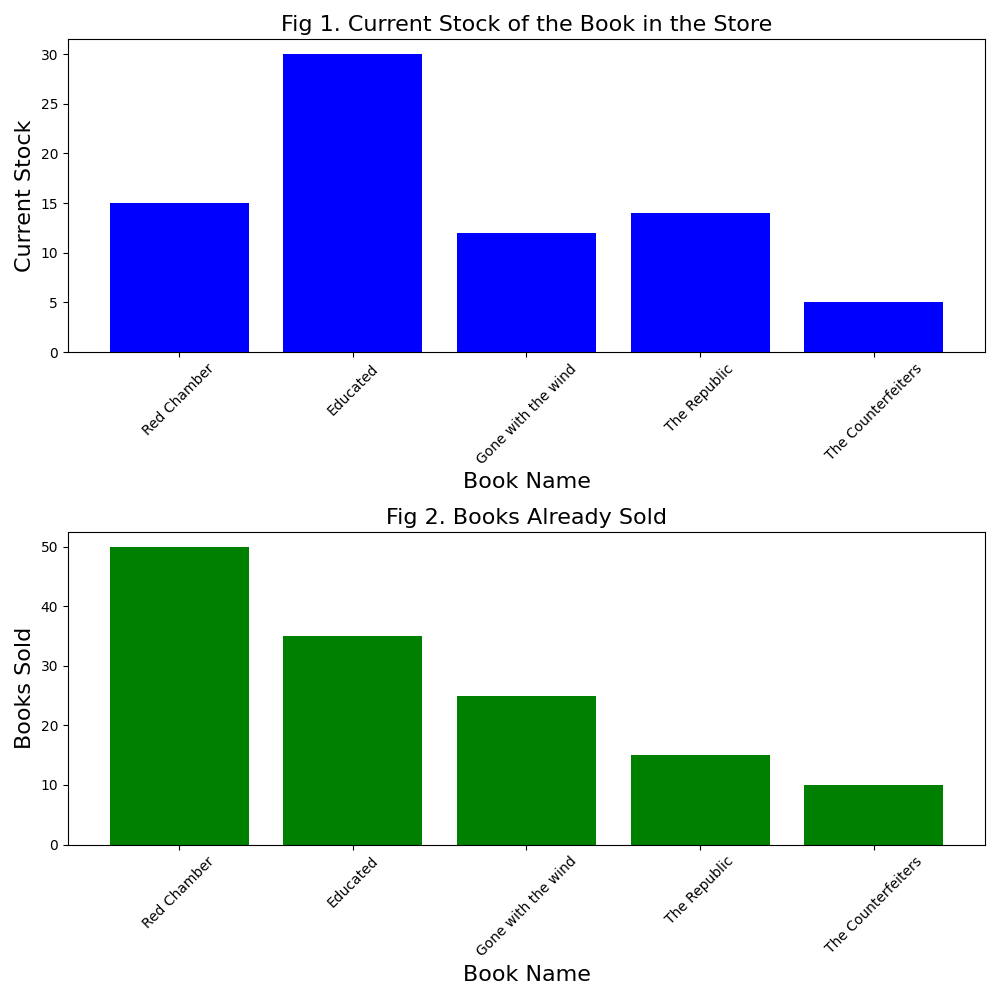

# ids706_python_template
Individual Project1 for ids706: 
- Continuous Integration using GitHub Actions of Python Data Science Project

## Requirements

- Python 3.8+
- Virtual environment (optional but recommended, already set up as env in Makefile)
- Packages listed in `requirements.txt` including 

## Structure
- A jupyter notebook: `descriptive_stats.ipynb`
- Python Script performing the same descriptive statistics using Polars or Panda: `scipt.py`
- `lib.py` file that shares the common code between the script and notebook
- `Makefile` with functions elaborated in Badges section 
- test files including `tes_lib.py`, `test_script.py`
- `requirement.txt` file

## Badges
1. Run `make setup` to set up the virtual environment for the project.
note: only need to set up the environment once

2. Run `make install` to install all packages listed in requirement.txt

3. Run `make lint` to check up the style

4. Run `make format` to check up the format

5. Run `make test` to test the lib.py, script.py. Test jupyter notebook with descriptive_stats.ipynb with nbval plugin.

- Image is generated at this time, and the visual report of the dataset generated is:

6. Run `make all` to finish all the badges at the same time

## CI/CD
GitHub Actions are configured for Continuous Integration and Continuous Deployment. See `.github/workflows/ci_cd.yml` for details.

## Video
The link to the demo video is: https://youtu.be/D80YlpGayiE

